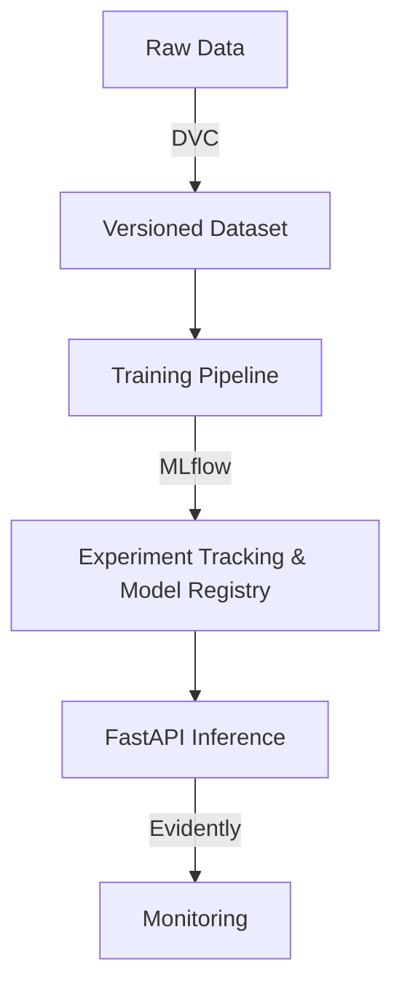
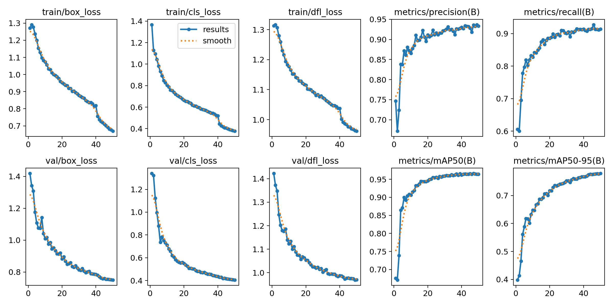
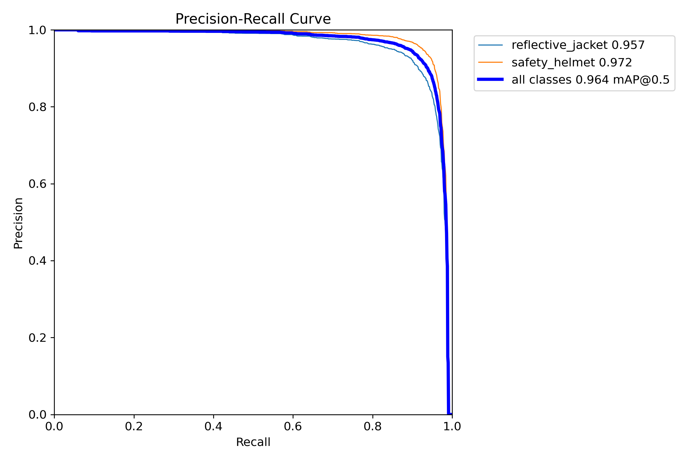
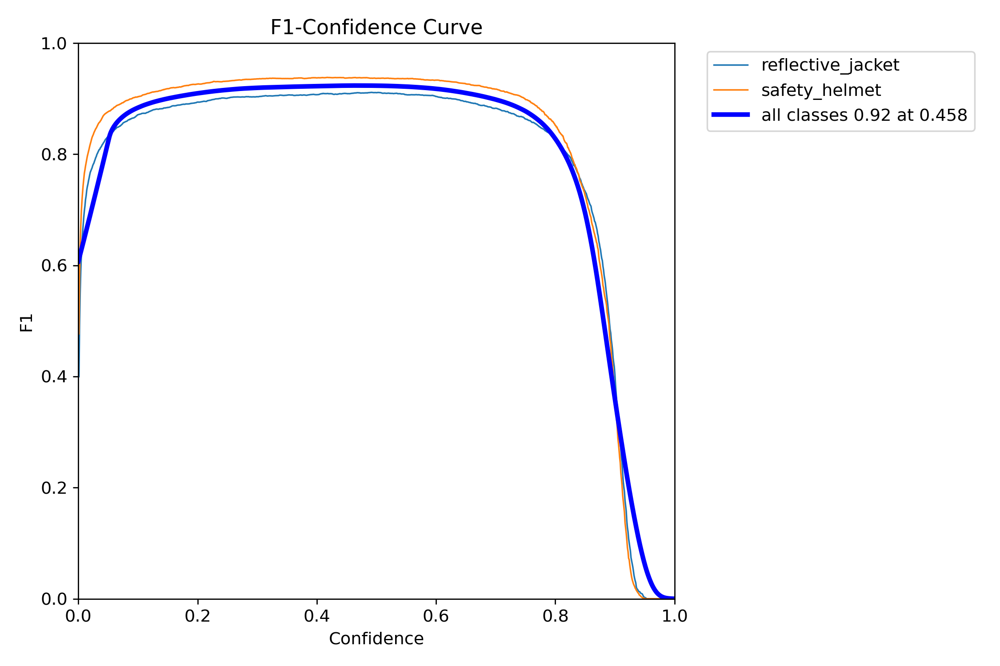
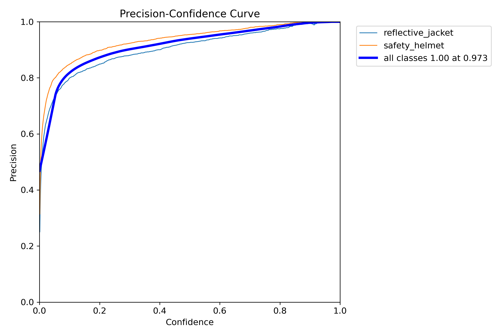
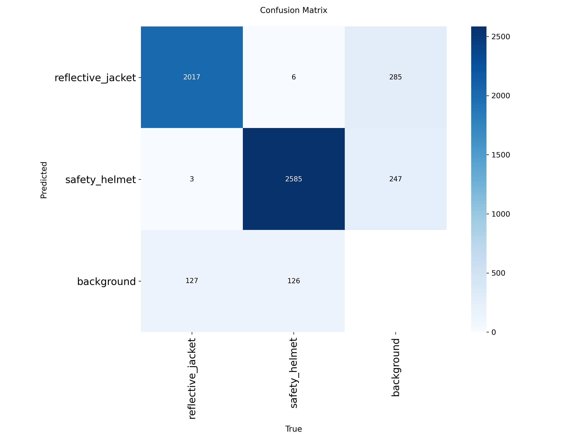
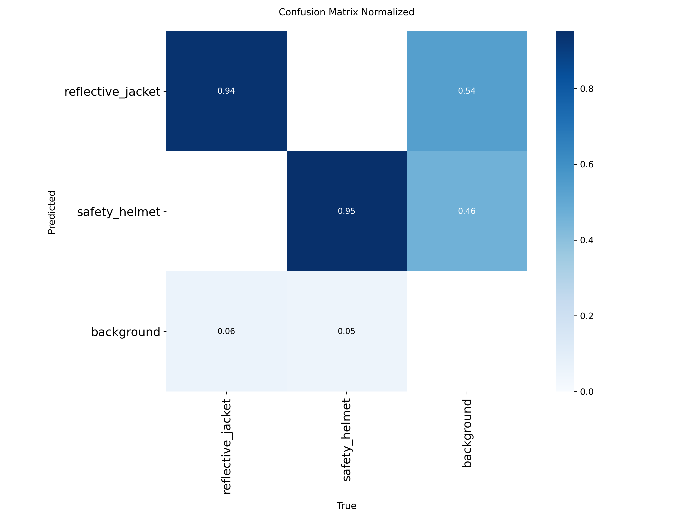
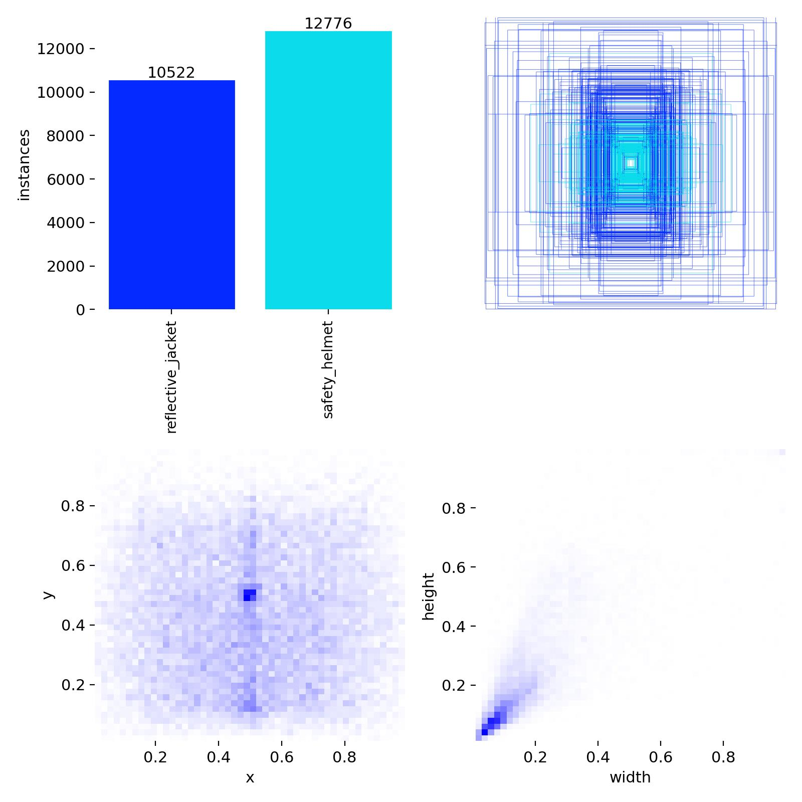

# SentinelOps

> Production-grade MLOps pipeline for PPE (Personal Protective Equipment) detection using YOLO object detection.

---

## Problem Statement

SentinelOps aims to provide a robust, scalable, and automated MLOps pipeline for computer vision models. Moving from isolated Jupyter notebooks to a structured, reproducible environment is crucial for bringing AI models reliably into production.

## Architecture Diagram



## Tech Stack

| Layer | Technology |
|-------|-----------|
| **Data Versioning** | DVC |
| **Experiment Tracking** | MLflow + DagsHub |
| **Modeling** | Ultralytics YOLO11 |
| **Inference API** | FastAPI, Uvicorn |
| **Dashboard** | Streamlit |
| **Monitoring** | Evidently |
| **Testing & Formatting** | Pytest, Black, Flake8 |

---

## PPE Detection Model

**Model:** YOLO11s (Fine-Tuned)

**Classes:**
- 🦺 Reflective Jacket
- ⛑️ Safety Helmet

**Dataset:**
- **4,864** labeled instances
- **1,427** validation images

### Performance

| Metric | Value |
|--------|-------|
| Precision | **93.3%** |
| Recall | **91.4%** |
| mAP50 | **96.4%** |
| mAP50-95 | **77.9%** |

> The model achieves near-production accuracy with a precision–recall balance above 90%, making it suitable for real-time safety monitoring.

---

## Training Artifacts

### Training Curves



### Precision–Recall & F1

| Precision–Recall Curve | F1 Curve |
|:---:|:---:|
|  |  |

### Precision Curve



### Confusion Matrices

| Standard | Normalised |
|:---:|:---:|
|  |  |

### Label Distribution



> 📖 For detailed explanations of each chart, see [docs/training/README.md](docs/training/README.md).

---

## Training Summary

| Parameter | Value |
|-----------|-------|
| Architecture | YOLO11s |
| Framework | Ultralytics |
| Tracking | MLflow + DagsHub |
| Training Time | 2.44 hours |
| GPU | NVIDIA Tesla T4 |
| Input Size | 640×640 |
| Epochs | 50 |

---

## Model Weights

The `models/ppe_detector/best.pt` file contains the best-performing checkpoint selected by validation mAP during training. It can be loaded directly with the Ultralytics library:

```python
from ultralytics import YOLO

model = YOLO("models/ppe_detector/best.pt")
```

---

## Example Inference

```python
from ultralytics import YOLO

model = YOLO("models/ppe_detector/best.pt")

results = model.predict(
    source="video.mp4",
    conf=0.25,
    show=True,
    save=True
)
```

---

## Docker Deployment

SentinelOps includes a production-ready multi-stage Dockerfile that runs the API as a non-root user.

### Build the Image

```bash
docker build -t sentinelops:latest .
```

### Run the Container

```bash
docker run -d \
  --name sentinelops \
  -p 8000:8000 \
  -e HOST=0.0.0.0 \
  -e PORT=8000 \
  -v $(pwd)/artifacts:/app/artifacts \
  -v $(pwd)/config:/app/config \
  sentinelops:latest
```

This maps port 8000, provides required environment variables, and mounts the `artifacts` and `config` directories so persistent data is retained outside the container.

---

## Configuration Management

SentinelOps uses `pydantic-settings` for robust, type-checked centralized configuration.

All settings are managed via the `ENVIRONMENT` variable (defaults to `dev`).
This variable automatically loads the corresponding `.env` file from the `config/environments/` directory.

- **Development (`ENVIRONMENT=dev`)**: Loads `config/environments/.env.dev`. Uses local `artifacts/` directories.
- **Production (`ENVIRONMENT=prod`)**: Loads `config/environments/.env.prod`. Connects to external databases (postgres/redis) and mounted volume paths.

If you are running the system outside of Docker Compose, ensure you copy `.env.example` to `.env` and set `ENVIRONMENT=dev` or your desired target.

---

## Docker Compose Deployment (Recommended)

SentinelOps includes a `docker-compose.yml` for standing up the full infrastructure stack (Backend API, PostgreSQL, Redis) simultaneously.

1. Ensure you have populated your environment variables (see `.env.example`).
2. Bring up the stack in detached mode:

```bash
docker-compose up -d
```

The services are configured with health checks and persistent volumes for databases and application artifacts.

To view logs:
```bash
docker-compose logs -f backend
```

To tear down the stack:
```bash
docker-compose down
```

---

## Repository Structure

```text
.
├── app/                # Alert management system (API + service)
├── config/             # Centralised settings
├── dashboard/          # Streamlit dashboards
├── docs/               # Documentation & training artifacts
│   └── training/       # Evaluation curves & confusion matrices
├── inference/          # Model loader, predictor, tracker, compliance
│   └── api/            # FastAPI inference service
├── models/
│   └── ppe_detector/   # Production model weights
├── monitoring/         # Data drift monitoring
├── schemas/            # Typed data schemas
├── scripts/            # Utility scripts
├── src/                # Dataset validation, model registry
├── tests/              # Unit & structural tests
├── training/           # Training configs & presets
├── utils/              # Logger, image validator
├── .gitignore
├── Makefile
├── README.md
└── requirements.txt
```

## Project Roadmap

- [x] **Phase 0**: Project Foundation (Setup, Environments, Boilerplate)
- [x] **Phase 1**: Dataset Versioning & Preparation
- [x] **Phase 2**: Model Training & Experiment Tracking
- [x] **Phase 3**: Inference API (FastAPI)
- [ ] **Phase 4**: Monitoring Dashboard (Streamlit & Evidently)
- [ ] **Phase 5**: CI/CD and Cloud Deployment

## Future Improvements

- Cloud integration (AWS S3 / GCP Cloud Storage) for DVC remotes.
- Automated CI/CD pipelines with GitHub Actions.
- [x] Dockerization of the inference and dashboard services.
- Advanced monitoring alerts and drift-triggered retraining.
