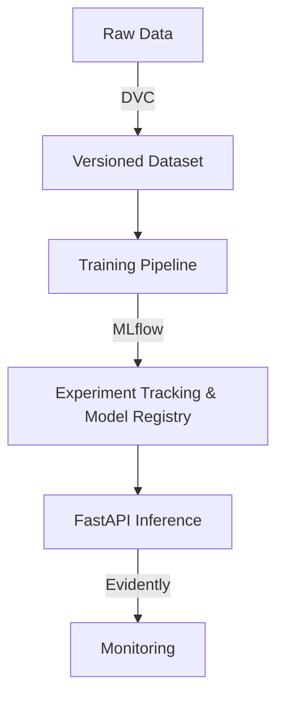

# SentinelOps

## Problem Statement
SentinelOps aims to provide a robust, scalable, and automated MLOps pipeline for computer vision models. Moving from isolated Jupyter notebooks to a structured, reproducible environment is crucial for bringing AI models reliably into production.

## Architecture Diagram


## Tech Stack
- **Data Versioning**: DVC
- **Experiment Tracking**: MLflow
- **Modeling**: Ultralytics (YOLO)
- **API**: FastAPI, Uvicorn
- **Dashboard UI**: Streamlit
- **Monitoring**: Evidently
- **Testing & Formatting**: Pytest, Black, Flake8

## Project Roadmap
- **Phase 0**: Project Foundation (Setup, Environments, Boilerplate)
- **Phase 1**: Dataset Versioning & Preparation
- **Phase 2**: Model Training & Experiment Tracking
- **Phase 3**: Inference API (FastAPI)
- **Phase 4**: Monitoring Dashboard (Streamlit & Evidently)
- **Phase 5**: CI/CD and Cloud Deployment

## Repository Structure
```text
.
├── docs/               # Project documentation
├── scripts/            # Bash and setup scripts
├── src/                # Main source code (API, Training, Utils)
├── tests/              # Unit and integration tests
├── .env.example        # Environment variable template
├── .gitignore          # Git ignore file
├── Makefile            # Automation commands
├── README.md           # Project overview
└── requirements.txt    # Python dependencies
```

## Future Improvements
- Cloud integration (AWS S3/GCP Cloud Storage) for DVC remotes.
- Automated CI/CD pipelines with GitHub Actions.
- Dockerization of the inference and dashboard services.
- Advanced monitoring alerts.
